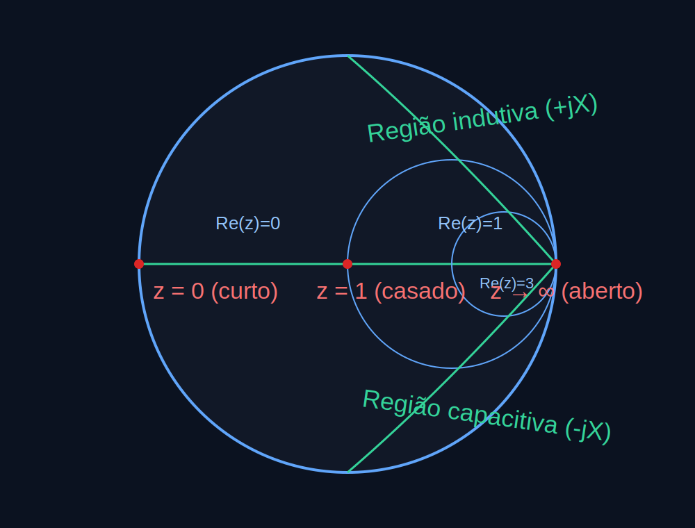

# Apostila Prática — NanoVNA V2 / NanoVNA-F V2

**Base documental usada nesta apostila**
- *NanoVNA-F V2 Portable Vector Network Analyzer User Guide Rev. 2.0* (para firmware v0.3.0)
- *UG101E NanoVNA-FV2 Menu Structure Map v0.6.0*

**Objetivo**
Esta apostila foi organizada para uso prático de bancada. Ela explica:
- como o NanoVNA V2 funciona;
- onde fica cada função no menu;
- quando usar cada função;
- como aplicar cada recurso em medições reais;
- exemplos extras voltados para **projeto, validação e depuração de PCB RF**.

---

# 1. O que é o NanoVNA V2

O NanoVNA V2 é um **analisador vetorial de redes de duas portas**. Ele mede como um circuito ou dispositivo se comporta ao longo de uma faixa de frequência.

Na prática, ele injeta RF e mede:
- **quanto do sinal é refletido** de volta para a porta de origem;
- **quanto do sinal atravessa** o dispositivo e chega na outra porta.

Essas medições aparecem como parâmetros S:
- **S11**: reflexão na porta 1;
- **S21**: transmissão da porta 1 para a porta 2;
- **S22** e **S12**: podem ser obtidos trocando as conexões das portas.

## 1.1 Faixa e capacidades principais

O guia do equipamento informa:
- faixa de frequência: **50 kHz a 3 GHz**;
- até **201 pontos** de sweep;
- até **4 traces**;
- até **4 markers**;
- **7 memórias** para salvar calibração/configuração.

## 1.2 O que ele mede melhor

### Em S11
Use S11 para analisar:
- antenas;
- redes de matching;
- entradas RF de PCB;
- filtros de 1 porta;
- stubs;
- conectores;
- cabos com TDR;
- impedância e ressonância.

### Em S21
Use S21 para analisar:
- filtros de 2 portas;
- trilhas RF em PCB tratadas como interconexão;
- atenuadores;
- cabos;
- acopladores;
- divisores;
- ganho/perda de estágios lineares;
- resposta em frequência entre dois pontos do circuito.

---

# 2. Como pensar o uso do NanoVNA

O fluxo correto de trabalho quase sempre é este:

1. Definir **o que será medido**.
2. Escolher **S11** ou **S21**.
3. Ajustar a **faixa de frequência**.
4. Escolher o **formato de exibição**.
5. Fazer a **calibração na mesma faixa e no mesmo plano de medição**.
6. Conectar o DUT.
7. Ler a curva com **markers**.
8. Refinar a janela de frequência se necessário.
9. Salvar o setup ou exportar S1P/S2P/CSV.

## 2.1 Regra de ouro

**Calibre exatamente onde o DUT será conectado.**

Se houver cabo, pigtail, adaptador SMA, launch de PCB ou fixture entre o NanoVNA e o circuito, esse trecho passa a fazer parte do sistema de medição. Portanto, o plano de referência ideal é a ponta desse conjunto, não apenas o conector do equipamento.

---

# 3. Visão rápida da interface

## 3.1 Elementos principais da tela

Na tela principal normalmente aparecem:
- frequência de início (**START**);
- frequência de fim (**STOP**);
- marcadores;
- status da calibração;
- posição de referência dos traces;
- tabela dos markers;
- caixa de status dos traces;
- tensão da bateria;
- escala esquerda/direita;
- quantidade de pontos do sweep.

## 3.2 Significado dos indicadores de calibração

Na barra inferior:
- **O** = OPEN realizado;
- **S** = SHORT realizado;
- **L** = LOAD realizado;
- **T** = THRU/THROUGH realizado;
- **C** = calibração aplicada;
- **\*** = calibração ainda não salva;
- **c** = calibração interpolada;
- **C0…C6** = slot salvo carregado.

## 3.3 Abertura do menu

Você pode abrir o menu de duas formas:
- tocando a área de menu na tela;
- pressionando o botão lateral do meio.

## 3.4 Teclado virtual

O teclado aceita:
- números;
- ponto decimal;
- unidades **G**, **M**, **k**;
- **OK**.

Exemplos:
- `100 + k` = 100 kHz;
- `433.92 + M` = 433,92 MHz;
- `2.4 + G` = 2,4 GHz.

---

# 4. Entendimento operacional dos parâmetros S

## 4.1 S11 — reflexão

S11 mostra como a energia “enxerga” a impedância na porta 1.

### No uso prático
- S11 baixo em dB geralmente indica bom casamento;
- SWR baixo também indica bom casamento;
- no Smith chart, ficar perto do centro indica proximidade de 50 ohms.

### Em PCB
S11 é ideal para:
- verificar a entrada RF de um front-end;
- ajustar rede LC de matching em antena impressa;
- conferir a adaptação de um LNA/PA em um ponto específico;
- validar o launch SMA → microstrip;
- avaliar stub, filtro shunt, rede PI/T ou rede série-shunt.

## 4.1.1 Carta de Smith — leitura rápida

A Carta de Smith é uma forma gráfica de enxergar a impedância complexa normalizada (`R + jX`) e o coeficiente de reflexão.

Interpretação prática rápida:
- centro da carta: casamento (`Z = 50 ohms`, reflexão mínima);
- lado esquerdo extremo: curto-circuito (`Z = 0`);
- lado direito extremo: circuito aberto (`Z -> infinito`);
- **parte superior da carta**: impedância com componente **indutiva** (`+jX`);
- **parte inferior da carta**: impedância com componente **capacitiva** (`-jX`);
- quanto mais perto da borda externa, maior o módulo da reflexão.

Diagrama de apoio:

## 4.2 S21 — transmissão

S21 mostra quanto sinal vai da porta 1 para a porta 2.

### No uso prático
- próximo de 0 dB: pouca perda ou ganho próximo da unidade;
- valor negativo: perda de inserção;
- valor positivo: ganho.

### Em PCB
S21 é ideal para:
- medir perda de um filtro em placa;
- comparar diferentes comprimentos de trilha RF;
- validar uma linha microstrip entre dois conectores;
- ver resposta em frequência de um bloco passa-faixa/passa-baixa/passa-alta;
- medir isolamento ou acoplamento em redes entre blocos;
- verificar se uma via fence ou transição de camada degradou a resposta.

---

# 5. Menus do NanoVNA V2 — função por função

# 5.1 DISPLAY

Caminho:
`DISPLAY -> TRACE / FORMAT / SCALE / REF POS / CHANNEL`

## 5.1.1 TRACE

### Para que serve
Liga, desliga e seleciona até 4 traces.

### Quando usar
- comparar S11 e S21 simultaneamente;
- ver mais de um formato da mesma medição;
- usar um trace para LOGMAG e outro para Smith;
- comparar resposta de diferentes configurações.

### Como usar
1. Abra `DISPLAY`.
2. Entre em `TRACE`.
3. Ative `TRACE 0`, `TRACE 1`, `TRACE 2` ou `TRACE 3`.
4. O trace ativo é o que receberá as alterações de canal, formato e escala.

### Exemplo em PCB
Ao depurar um filtro passa-faixa em placa:
- `TRACE 0`: S21 LOGMAG;
- `TRACE 1`: S21 PHASE;
- `TRACE 2`: S11 LOGMAG.

Assim você vê passagem, fase e casamento da entrada na mesma tela.

---

## 5.1.2 FORMAT

### Para que serve
Define como o trace será exibido.

### Formatos e uso típico

#### LOGMAG
Mostra amplitude logarítmica versus frequência.

Use para:
- retorno;
- perda de inserção;
- ganho;
- notch;
- ripple;
- banda passante.

**Em PCB:** formato principal para validar filtros, linhas, conectores e acoplamento entre blocos.

#### PHASE
Mostra fase versus frequência.

Use para:
- comportamento de fase de filtros;
- comparação entre caminhos RF;
- avaliação de coerência de fase em redes divisoras.

**Em PCB:** útil para comparar duas topologias de linha ou duas rotas de RF.

#### DELAY
Mostra group delay versus frequência.

Só faz sentido em **S21**.

Use para:
- filtros;
- linhas de transmissão;
- redes onde a variação de atraso importa.

**Em PCB:** útil para comparar duas rotas críticas ou verificar desuniformidade de filtro na placa.

#### SMITH R+jX
Mostra impedância complexa no diagrama de Smith.

Só faz sentido em **S11**.

Use para:
- matching;
- leitura de resistência + reatância;
- localização do ponto de ressonância.

**Em PCB:** muito útil em ajuste de antena impressa, entrada de LNA, saída de PA e matching de filtros discretos.

#### SMITH R+L/C
Mostra a impedância no Smith, com equivalente em resistência e indutância/capacitância.

**Em PCB:** excelente para decidir se o circuito “parece mais indutivo ou mais capacitivo” antes de escolher um componente de correção.

#### SWR
Mostra a VSWR.

Só faz sentido em **S11**.

Use para:
- ajuste rápido de antena;
- decisão prática de aprovação/reprovação.

**Em PCB:** muito útil em antenas embarcadas e conectores RF de placas de telecom e IoT.

#### Q FACTOR
Mostra fator Q.

Use para:
- ressonadores;
- circuitos seletivos;
- estudo de comportamento ressonante.

**Em PCB:** útil em filtros LC estreitos, tanques LC e circuitos sintonizados.

#### POLAR
Visualização polar.

Só faz sentido em **S11**.

Use quando quiser uma visualização geométrica alternativa do comportamento complexo.

#### LINEAR
Amplitude linear versus frequência.

Útil em comparações específicas quando escala logarítmica não ajuda.

#### REAL / IMAG
Mostram parte real e imaginária do parâmetro S.

**Em PCB:** úteis para análise mais técnica e correlação com simulação.

#### RESISTANCE / REACTANCE
Mostram resistência e reatância diretamente.

**Em PCB:** muito úteis quando você quer decidir o valor e o tipo de componente de matching sem depender apenas do Smith.

---

## 5.1.3 SCALE

### Para que serve
Ajusta a escala vertical.

### Quando usar
- quando a curva está “achatada” demais;
- para ampliar pequenas ondulações;
- para enxergar melhor ripple ou notch.

### Observação
Não se aplica a `SMITH` e `POLAR`.

### Exemplo em PCB
Ao comparar perda de uma trilha curta com outra um pouco mais longa, aumentar a sensibilidade da escala ajuda a evidenciar diferenças pequenas de inserção.

---

## 5.1.4 REF POS

### Para que serve
Move a posição de referência vertical do trace.

### Quando usar
- para organizar melhor traces na tela;
- para evitar sobreposição visual;
- para destacar um traço específico.

### Observação
Não se aplica a `SMITH` e `POLAR`.

### Exemplo em PCB
Quando você mostra ao mesmo tempo S11 e S21 de um filtro em placa, mover as referências evita confusão visual entre curvas.

---

## 5.1.5 CHANNEL

### Para que serve
Seleciona o canal do trace ativo:
- `S11 (REFL)`
- `S21 (THRU)`

### Quando usar
- trocar rapidamente entre reflexão e transmissão;
- montar telas com múltiplos traces de canais diferentes.

### Exemplo em PCB
Em um filtro SAW ou LC em placa:
- use S11 para ver casamento de entrada;
- use S21 para ver a curva de transmissão.

---

# 5.2 MARKER

Caminho:
`MARKER -> SELECT / SEARCH / OPERATE / DRAG ON`

## 5.2.1 SELECT

### Para que serve
Ativa/desativa até 4 markers e permite reposicionar a tabela dos markers.

### Quando usar
- leitura de frequência exata;
- comparar vários pontos do gráfico;
- medir bordas de banda, pico, notch e frequência central.

### Exemplo em PCB
Em um filtro passa-faixa:
- Marker 1 na frequência central;
- Marker 2 na borda inferior de -3 dB;
- Marker 3 na borda superior de -3 dB;
- Marker 4 em uma frequência de rejeição fora da banda.

---

## 5.2.2 SEARCH

### Para que serve
Encontra automaticamente máximos, mínimos ou busca relativa.

### Funções
- `MAXIMUM`
- `MINIMUM`
- `SEARCH < LEFT`
- `SEARCH > RIGHT`
- `TRACKING`

### Quando usar
- `MINIMUM`: ressonância de antena, ponto de menor retorno;
- `MAXIMUM`: pico de transmissão;
- `TRACKING`: acompanhar automaticamente máximo ou mínimo a cada sweep.

### Exemplo em PCB
Ao ajustar uma rede de matching de antena impressa:
1. deixe S11 em LOGMAG;
2. use `MINIMUM`;
3. habilite `TRACKING`;
4. troque componentes série/shunt na placa;
5. observe o vale andando até a frequência desejada.

---

## 5.2.3 OPERATE

### Para que serve
Usa o marker para redefinir a faixa de análise.

### Funções
- `>START`
- `>STOP`
- `>CENTER`
- `>SPAN`

### Quando usar
- para dar zoom em uma área importante;
- para isolar melhor um notch ou pico;
- para recentrar a medição.

### Exemplo em PCB
Ao encontrar uma ressonância parasita em 1,83 GHz numa linha ou filtro:
1. coloque o marker no ponto;
2. use `>CENTER`;
3. reduza o span;
4. refine a análise.

---

## 5.2.4 DRAG ON

### Para que serve
Habilita arrastar a tabela dos markers.

### Quando usar
- quando a tabela está cobrindo o gráfico.

### Exemplo em PCB
Em filtros de alta seletividade, a tabela pode esconder o notch. Mover a tabela resolve isso rapidamente.

---

# 5.3 STIMULUS

Caminho:
`STIMULUS -> START / STOP / CENTER / SPAN / CW PULSE / SIGNAL GENERATOR / PAUSE SWEEP`

## 5.3.1 START

### Para que serve
Define a frequência inicial da varredura.

### Quando usar
Quando você sabe o limite inferior da banda de interesse.

### Exemplo em PCB
Para um circuito em 2,4 GHz, começar em 2,2 GHz pode ser melhor do que começar muito abaixo, pois melhora foco visual e tempo de análise.

---

## 5.3.2 STOP

### Para que serve
Define a frequência final da varredura.

### Quando usar
Quando você sabe o limite superior da banda.

### Exemplo em PCB
Para validar um filtro de 915 MHz, usar algo como 700 MHz a 1,1 GHz pode ser uma janela inicial adequada.

---

## 5.3.3 CENTER

### Para que serve
Define a frequência central da medição.

### Quando usar
Quando a aplicação gira em torno de uma frequência conhecida.

### Exemplo em PCB
Em 868 MHz, faz muito sentido trabalhar com `CENTER = 868 MHz` e ajustar o span conforme a necessidade.

---

## 5.3.4 SPAN

### Para que serve
Define a largura da faixa de varredura.

### Quando usar
- sweep largo para procura inicial;
- sweep estreito para ajuste fino.

### Exemplo em PCB
Durante a depuração de uma antena impressa:
- primeiro use span largo para localizar a ressonância;
- depois reduza o span para ver melhor SWR e impedância perto da frequência alvo.

---

## 5.3.5 CW PULSE

### Para que serve
Configura frequência de pulso CW.

### Observação importante
Nesse modo, a saída da porta 1 é **pulsada**, não contínua.

### Quando usar
É um recurso mais específico. Não é o modo padrão de varredura para análise de redes.

### Em PCB
Pode ser útil em testes particulares de excitação, mas para a maioria dos trabalhos de caracterização de PCB RF, o uso principal continuará sendo sweep ou gerador simples.

---

## 5.3.6 SIGNAL GENERATOR

### Para que serve
Transforma o NanoVNA em um gerador simples de frequência fixa.

### Funções disponíveis
- `RF OUT`
- `FREQ`
- `0 dB`
- `-3 dB`
- `-6 dB`
- `-9 dB`

### Quando usar
- injeção simples de RF;
- teste rápido de resposta de um receptor;
- rastreio básico de caminho RF;
- testes de bancada sem varredura completa.

### Exemplo em PCB
Você pode injetar um tom de teste no caminho RF de uma placa receptora e verificar, com outro instrumento ou detector, se o sinal chega ao ponto desejado.

### Limitação prática
Essa função é útil para testes simples, mas não substitui um gerador RF de laboratório em pureza espectral, estabilidade e faixa de recursos.

---

## 5.3.7 PAUSE SWEEP

### Para que serve
Pausa ou retoma a varredura.

### Quando usar
- congelar a tela para observação;
- registrar leitura;
- comparar estado antes/depois de uma pequena intervenção.

### Exemplo em PCB
Ao tocar um componente SMD de matching com a pinça térmica ou ao trocar um capacitor, pausar ajuda a capturar um estado específico da medição.

---

# 5.4 CAL

Caminho:
`CAL -> CALIBRATE / RESET / APPLY`

## 5.4.1 APPLY

### Para que serve
Liga/desliga a aplicação da calibração.

### Quando usar
- comparar resultado calibrado e não calibrado;
- confirmar se a correção está realmente sendo aplicada.

### Exemplo em PCB
Ao medir um fixture improvisado ou um cabo ruim, você pode perceber o quanto a calibração está corrigindo o sistema ao alternar `APPLY`.

---

## 5.4.2 RESET

### Para que serve
Limpa a calibração da memória ativa.

### Quando usar
- para refazer a calibração do zero;
- quando a faixa mudou muito;
- quando houve alteração de cabos/adaptadores;
- quando existe suspeita de erro de calibração.

### Observação
Não apaga o que já está salvo em FLASH.

---

## 5.4.3 CALIBRATE

### Para que serve
Executa a calibração do sistema.

## Passo a passo completo

1. Ajuste a faixa de frequência de medição.
2. Entre em `CAL -> CALIBRATE`.
3. Conecte **OPEN** na porta 1 ou na ponta do cabo/fixture.
4. Toque `OPEN`.
5. Conecte **SHORT**.
6. Toque `SHORT`.
7. Conecte **LOAD**.
8. Toque `LOAD`.
9. Ligue `PORT1` a `PORT2` com cabo/adaptador.
10. Toque `THRU`.
11. Toque `DONE`.
12. Salve em um slot `SAVE n`.

## Como saber se a calibração ficou coerente

O comportamento esperado é:
- aberto: S11 Smith vai para a direita;
- curto: S11 Smith vai para a esquerda;
- carga de 50 ohms: Smith no centro;
- through entre portas: S21 perto de 0 dB.

## Erros comuns
- calibrar em uma faixa e medir em outra muito diferente;
- calibrar direto no VNA e depois usar cabo longo até o DUT;
- esquecer o THRU em medições S21;
- mudar adaptadores depois da calibração;
- medir PCB por meio de launch/pigtail sem considerar esse trecho no plano de referência.

## Exemplo em PCB
### Caso 1 — launch SMA para microstrip
Se o DUT é uma placa com conector SMA de borda:
- use cabos e adaptadores já montados na condição real;
- calibre até o ponto que realmente representa a entrada da placa.

### Caso 2 — medição via fixture/pigtail U.FL
Se você usa cabo coaxial curto soldado ou adaptador U.FL:
- ele faz parte da medição;
- idealmente a calibração precisa considerar esse trecho.

---

# 5.5 RECALL/SAVE

Caminho:
`RECALL/SAVE -> RECALL / SAVE`

## RECALL

### Para que serve
Recupera calibrações e configurações salvas.

### Quando usar
- repetir medição recorrente;
- alternar entre bandas;
- voltar rapidamente a uma bancada padrão.

## SAVE

### Para que serve
Salva calibração e configurações.

### Quando usar
- manter perfis por banda;
- guardar setups por projeto;
- padronizar uma rotina de validação.

### Exemplo em PCB
Você pode organizar os slots assim:
- `C0`: 433 MHz;
- `C1`: 868/915 MHz;
- `C2`: 2,4 GHz;
- `C3`: filtro IF específico;
- `C4`: cabo de bancada curto;
- `C5`: fixture A;
- `C6`: fixture B.

---

# 5.6 TDR

Caminho:
`TDR -> TDR ON / LOW PASS IMPULSE / LOW PASS STEP / BANDPASS / WINDOW / VELOCITY FACTOR`

## Para que serve
Converte a informação de reflexão em uma visão no domínio do tempo/distância.

## Importante
O TDR é **significativo para S11**.

## Quando usar
- localizar descontinuidades em cabo;
- estimar comprimento elétrico;
- identificar falhas de conexão;
- estudar descontinuidades em interconexões.

## Modos
- `LOW PASS IMPULSE`
- `LOW PASS STEP`
- `BANDPASS` (padrão)

## WINDOW
Suaviza a resposta e ajuda a reduzir ringing.

Níveis:
- `MINIMUM`
- `NORMAL`
- `MAXIMUM`

## VELOCITY FACTOR
Define a velocidade relativa de propagação.

É essencial para converter corretamente tempo em distância.

## Regras práticas
- maior frequência máxima -> melhor resolução temporal;
- menor espaçamento entre pontos -> maior alcance;
- sempre existe troca entre resolução e alcance.

## Exemplo em cabos
1. conecte o cabo em `PORT1`;
2. deixe a outra ponta aberta ou em curto;
3. habilite `TDR ON`;
4. ajuste o fator de velocidade;
5. mova o marker até o pico de reflexão.

## Exemplo em PCB
### Cenário 1 — linha RF longa em placa
O TDR portátil não substitui um TDR de laboratório para análise fina de impedância controlada, mas pode ajudar a perceber descontinuidades grosseiras em interconexões, launches e transições.

### Cenário 2 — launch SMA ruim
Se o launch do conector para microstrip tiver geometria inadequada, excesso de solda, retorno de terra ruim ou via stitching insuficiente, a resposta no domínio do tempo pode mostrar uma perturbação próxima da entrada.

### Cenário 3 — comparação entre revisões de PCB
Ao comparar Rev.A e Rev.B, o TDR pode ajudar a indicar se a nova transição de camada ou o novo conector pioraram a uniformidade da interconexão.

---

# 5.7 CONFIG

Caminho:
`CONFIG -> E-DELAY / L/C MATCH / SWEEP POINTS / (AVERAGE em fw mais novo) / TOUCH TEST / LANGSET / ABOUT / BRIGHTNESS`

## Observação sobre firmware
O manual principal detalha a estrutura do firmware v0.3.0. O mapa de menus v0.6.0 mostra itens extras ou renomeados, como `AVERAGE`, `SAVE CSV`, `CSV LIST` e `E-DELAY` com nome abreviado.

---

## 5.7.1 ELECTRICAL DELAY / E-DELAY

### Para que serve
Compensa atraso elétrico de conectores e cabos.

### Quando usar
- remover efeito de um pequeno trecho conhecido;
- alinhar fase;
- compensar fixture curto;
- melhorar leitura em medições onde o atraso externo desloca a interpretação.

### Exemplo em PCB
Se você usa um cabo curto fixo ou um fixture de teste entre o VNA e a placa, o atraso elétrico pode ajudar a deixar a leitura mais coerente, especialmente em fase e em análises relativas.

---

## 5.7.2 L/C MATCH

### Para que serve
Calcula redes de matching para adaptar a impedância medida a 50 ohms.

### Quando usar
- antena impressa;
- entrada de LNA;
- saída de PA;
- rede entre filtro e estágio seguinte;
- qualquer nó RF que precise de adaptação.

## Passo a passo prático
1. meça o ponto em `S11`;
2. use formato `SMITH R+jX` ou `SMITH R+L/C`;
3. deixe o marker na frequência de interesse;
4. entre em `CONFIG -> L/C MATCH`;
5. observe as soluções sugeridas;
6. escolha a topologia mais compatível com sua PCB e BOM.

## Exemplo em PCB
### Exemplo A — antena impressa 2,4 GHz
Suponha que a antena embarcada esteja apresentando impedância fora de 50 ohms na frequência alvo. O `L/C MATCH` sugere combinações série/shunt que podem ser implementadas nos footprints reservados para tuning.

### Exemplo B — saída de PA para filtro
Se a saída do estágio não estiver bem adaptada ao filtro, o recurso pode fornecer uma primeira aproximação de rede LC, que depois deve ser validada na prática e, idealmente, em simulação também.

### Atenção
As soluções geradas são úteis como **ponto de partida**. Em PCB real, o layout, o plano de terra, o valor parasita dos componentes e o encapsulamento alteram o resultado final.

---

## 5.7.3 SWEEP POINTS

### Para que serve
Define a quantidade de pontos do sweep.

Faixa informada: **11 a 201 pontos**.

### Quando usar
- menos pontos -> sweep mais rápido;
- mais pontos -> melhor detalhamento;
- em TDR, afeta alcance e resolução.

### Exemplo em PCB
- procura inicial de problema: poucos pontos podem bastar;
- ajuste fino de filtro estreito: use mais pontos;
- notch estreito em rede LC: mais pontos ajudam bastante.

---

## 5.7.4 AVERAGE

### Observação
O mapa de menus do firmware v0.6.0 mostra `AVERAGE`, mas o manual Rev. 2.0 não detalha essa função.

### Uso provável
Na prática, esse tipo de função costuma servir para reduzir ruído visual por média de varreduras, mas como o manual principal não detalha o comportamento, convém validar diretamente no equipamento antes de padronizar o uso.

---

## 5.7.5 TOUCH TEST

### Para que serve
Testa a tela de toque.

### Quando usar
- se o toque estiver impreciso;
- após queda, manutenção ou comportamento estranho.

---

## 5.7.6 LANGSET

### Para que serve
Seleciona idioma entre inglês e chinês.

---

## 5.7.7 ABOUT

### Para que serve
Mostra informações do equipamento:
- hardware;
- firmware;
- serial number;
- dados de suporte.

### Quando usar
- suporte técnico;
- conferência pós-upgrade;
- registro de bancada.

---

## 5.7.8 BRIGHTNESS

### Para que serve
Ajusta brilho em cinco níveis:
- 100%
- 80%
- 60%
- 40%
- 20%

### Quando usar
- economia de bateria;
- melhor leitura em campo ou em bancada escura.

---

# 5.8 STORAGE

Caminho no manual:
`STORAGE -> S1P / S2P / LIST`

Caminho ampliado no mapa v0.6.0:
- `SAVE DELAY`
- `SAVE S1P`
- `SAVE S2P`
- `SAVE CSV`
- `SNP LIST`
- `CSV LIST`

## 5.8.1 S1P

### Para que serve
Salvar resultados de **S11**.

### Quando usar
- antenas;
- matching;
- entrada RF;
- reflexão de redes de 1 porta.

### Em PCB
Muito útil para comparar revisões de antena impressa, launch SMA, stub ou rede de entrada.

---

## 5.8.2 S2P

### Para que serve
Salvar resultados de **S11 e S21**.

### Quando usar
- filtros;
- linhas de transmissão;
- atenuadores;
- redes de 2 portas.

### Em PCB
Ideal para exportar a resposta real de uma placa e comparar com simulação ou com outra revisão.

---

## 5.8.3 LIST / SNP LIST / CSV LIST

### Para que serve
Listar arquivos armazenados.

### Quando usar
- conferir medições salvas;
- exportar depois para o PC;
- organizar documentação de bancada.

---

# 6. Exemplos gerais de uso

# 6.1 Medir uma antena

## Objetivo
Encontrar a frequência de ressonância, SWR e impedância.

## Passo a passo
1. Ajuste `START` e `STOP` para a banda da antena.
2. Configure um trace em `S11`.
3. Use `LOGMAG`, `SWR` ou `SMITH`.
4. Faça calibração `OPEN`, `SHORT`, `LOAD`.
5. Conecte a antena.
6. Ative um marker.
7. Use `SEARCH -> MINIMUM`.
8. Leia frequência, SWR e impedância.

## O que observar
- vale profundo em S11;
- SWR mínimo na frequência desejada;
- Smith próximo do centro se o casamento estiver bom.

---

# 6.2 Medir um filtro RF

## Objetivo
Ver banda passante, perda de inserção e rejeição.

## Passo a passo
1. Conecte entrada do filtro na `PORT1`.
2. Conecte saída na `PORT2`.
3. Configure `S21 LOGMAG`.
4. Faça calibração completa com `THRU`.
5. Meça o filtro.
6. Use markers para frequência central e bordas.
7. Se necessário, adicione trace em `PHASE` ou `DELAY`.

---

# 6.3 Medir perda de cabo

## Passo a passo
1. Cabo entre `PORT1` e `PORT2`.
2. Calibração completa.
3. Trace em `S21 LOGMAG`.
4. Leia a perda no marker.

---

# 6.4 Fazer matching

## Passo a passo
1. Meça em `S11`.
2. Coloque o marker na frequência de interesse.
3. Use `SMITH`.
4. Abra `CONFIG -> L/C MATCH`.
5. Avalie as soluções.
6. Monte a rede e meça novamente.

---

# 6.5 Usar TDR para cabo

## Passo a passo
1. Conecte cabo em `PORT1`.
2. Deixe outra ponta aberta ou em curto.
3. Ative `TDR ON`.
4. Ajuste `VELOCITY FACTOR`.
5. Mova marker até a reflexão.
6. Leia a distância estimada.

---

# 7. Exemplos específicos para projeto de PCB

# 7.1 Validação de launch SMA para microstrip

## Objetivo
Verificar se o conector SMA, o footprint e a transição para a trilha estão bem adaptados.

## Como medir
1. Conecte a placa ao NanoVNA pelo conector SMA da própria PCB.
2. Ajuste a faixa da aplicação.
3. Meça em `S11`.
4. Faça a calibração considerando o cabo usado na bancada.
5. Use `LOGMAG` e `SMITH`.

## O que procurar
- retorno ruim já perto da entrada;
- impedância muito indutiva ou muito capacitiva;
- comportamento pior do que o esperado para uma linha curta.

## Causas comuns em PCB
- antipads inadequados;
- falta de vias de terra perto do launch;
- transição abrupta de largura;
- excesso de solda;
- conector mal assentado.

---

# 7.2 Ajuste de antena impressa

## Objetivo
Ajustar a rede de matching de uma antena PCB em 433 MHz, 868 MHz, 915 MHz ou 2,4 GHz.

## Como medir
1. Reserve footprints série e shunt na placa.
2. Meça a antena em `S11`.
3. Use `SMITH R+jX` e `SWR`.
4. Posicione o marker na frequência desejada.
5. Use `L/C MATCH` como ponto de partida.
6. Troque os componentes e repita.

## O que procurar
- mínimo de S11 na frequência alvo;
- SWR aceitável na banda;
- impedância próxima de 50 ohms no centro da banda.

## Dica prática
O matching ideal no protótipo pode mudar na caixa final, perto de bateria, flat cable, display, carcaça metálica ou mão do usuário.

---

# 7.3 Medição de filtro LC em PCB

## Objetivo
Confirmar se o filtro montado na placa entrega a banda esperada.

## Como medir
1. Alimente a entrada do filtro pela `PORT1`.
2. Saída do filtro na `PORT2`.
3. Use `S21 LOGMAG`.
4. Adicione `S11` em outro trace se quiser ver casamento da entrada.
5. Calibre com THRU.

## O que procurar
- frequência central correta;
- perda de inserção compatível;
- largura de banda adequada;
- rejeição fora da banda.

## Problemas que aparecem em PCB
- indutores/capacitores com ESR/Q diferente do previsto;
- acoplamento parasita entre componentes;
- aterramento ruim;
- proximidade excessiva entre entrada e saída do filtro.

---

# 7.4 Comparação entre duas revisões de layout

## Objetivo
Decidir se Rev.B melhorou a resposta em relação à Rev.A.

## Como medir
1. Use o mesmo cabo e a mesma calibração, ou recalibre nas mesmas condições.
2. Meça a Rev.A e salve S1P/S2P.
3. Meça a Rev.B.
4. Compare banda, notch, perda e casamento.

## Aplicação
Útil para validar mudanças como:
- largura de microstrip;
- posição de vias de retorno;
- troca de conector;
- mudança de topologia do matching;
- reordenação do filtro na PCB.

---

# 7.5 Avaliação de caminho RF entre dois blocos

## Objetivo
Medir a perda entre dois pontos do caminho RF da placa.

## Como medir
1. Prepare pontos de acesso adequados ou conectores auxiliares.
2. Conecte `PORT1` no ponto de entrada do trecho.
3. Conecte `PORT2` no ponto de saída.
4. Use `S21 LOGMAG`.
5. Compare comprimentos e topologias.

## Uso típico
- trilha entre PA e filtro;
- trilha entre filtro e antena;
- linha entre LNA e SAW;
- interconexão entre placas ou módulos.

## Observação importante
Em PCB, muitas vezes o desafio está em acessar o trecho sem degradar a própria medição. O fixture de teste precisa ser pensado desde o projeto.

---

# 7.6 Investigação de descontinuidade em transição de camada

## Objetivo
Descobrir se uma via de RF ou mudança de camada introduziu desadaptação.

## Como abordar
- use S11 para analisar a entrada da interconexão;
- use S21 para medir a passagem total;
- use TDR como apoio para perceber descontinuidade mais grosseira;
- compare com uma rota equivalente sem mudança de camada.

## O que costuma causar problema
- antipads pequenos ou excessivos;
- retorno de terra interrompido;
- ausência de vias de blindagem/retorno;
- stub de via;
- transição mal compensada.

---

# 7.7 Uso do NanoVNA na fase de bring-up de uma placa RF

## Rotina sugerida
1. Validar launch e conectores.
2. Medir caminho passivo sem componentes ativos ligados, quando possível.
3. Medir filtro de entrada ou saída.
4. Ajustar matching da antena.
5. Exportar S1P/S2P para documentação do projeto.

## Benefício
Isso reduz tempo de diagnóstico e evita trocar componentes “no escuro”.

---

# 8. Procedimentos recomendados para PCB

# 8.1 Boas práticas de projeto para facilitar medições

Ao desenhar uma PCB RF, já pense na medição:
- reserve espaço para conectores ou pads coaxiais de teste;
- reserve componentes DNP para matching;
- documente o plano de referência de medição;
- deixe footprints alternativos quando o ajuste for provável;
- permita isolar blocos com resistores de 0 ohm ou jumpers;
- preveja acesso ao terra perto dos pontos de teste.

---

# 8.2 Boas práticas de bancada

- use cabos curtos e consistentes;
- não force conectores SMA da placa;
- recalibre sempre que mudar cabo/adaptador/faixa relevante;
- não compare medições feitas com fixtures diferentes sem critério;
- registre sweep, firmware, cabo, faixa e condição do DUT.

---

# 8.3 Limitações do NanoVNA em PCB RF

O NanoVNA é extremamente útil, mas não substitui todos os instrumentos de laboratório.

Tenha cuidado com:
- medições muito perto do limite superior da faixa;
- análise fina de impedância controlada em alta precisão;
- medições em circuitos ativos que exijam condições específicas de polarização e nível de potência;
- interpretação absoluta de resultados sem considerar fixture e parasitas.

Mesmo assim, para desenvolvimento e depuração de PCB RF, ele oferece excelente custo-benefício como ferramenta de:
- triagem;
- ajuste;
- comparação;
- validação inicial;
- documentação de resposta em frequência.

---

# 9. Software para PC

O manual informa compatibilidade com software PC e com o NanoVNA-Saver.

## O que pode ser feito pelo PC
- ajustar start e stop;
- obter medições;
- configurar markers;
- capturar screenshot da tela.

## Passo a passo básico
1. Conecte via USB-C.
2. Abra o software.
3. Selecione a porta COM correta.
4. Clique para conectar.
5. Use os recursos de leitura, markers e screenshot.

## Em projeto de PCB
O PC ajuda a:
- registrar resultados de protótipos;
- comparar revisões;
- gerar evidência de validação;
- salvar imagens para relatórios.

---

# 10. Console serial

O equipamento também oferece comandos de console serial.

## Para que serve
- automação;
- coleta de dados;
- integração com scripts;
- controle remoto do instrumento.

## Comandos úteis
- `help`
- `reset`
- `cwfreq`
- `data`
- `frequencies`
- `scan`
- `sweep`
- `pause`
- `resume`
- `trace`
- `marker`
- `save`
- `recall`
- `edelay`
- `capture`

## Em projeto de PCB
Esses comandos podem ser úteis para:
- registrar lotes de placas;
- automatizar comparação entre amostras;
- integrar medição a um procedimento de bancada repetitivo.

---

# 11. Atualização de firmware

## Passo a passo resumido
1. Conecte ao PC por USB-C.
2. Segure o botão do meio.
3. Ligue o aparelho.
4. Ele entra em modo virtual U-disk.
5. Copie `update.bin`.
6. Reinicie o equipamento.

## Observação
O manual informa que versões antigas podem exigir etapa intermediária com `update.all`.

---

# 12. Roteiros prontos de bancada

# 12.1 Roteiro — antena de PCB

1. `STIMULUS -> CENTER/SPAN` ou `START/STOP`
2. `DISPLAY -> CHANNEL = S11`
3. `DISPLAY -> FORMAT = SWR`
4. `DISPLAY -> TRACE` adicional em `SMITH`
5. `CAL -> CALIBRATE`
6. conectar DUT
7. `MARKER -> MINIMUM`
8. ajustar rede LC
9. salvar S1P

---

# 12.2 Roteiro — filtro em PCB

1. conectar filtro entre `PORT1` e `PORT2`
2. `DISPLAY -> CHANNEL = S21`
3. `FORMAT = LOGMAG`
4. `CALIBRATE` com THRU
5. marker no pico
6. markers nas bordas
7. salvar S2P

---

# 12.3 Roteiro — launch SMA

1. faixa centrada na frequência de trabalho
2. `S11 LOGMAG`
3. `S11 SMITH`
4. calibração no plano adequado
5. medir a placa
6. verificar se a entrada parece 50 ohms
7. comparar com outra revisão se houver

---

# 12.4 Roteiro — interconexão entre dois blocos RF

1. acessar os dois pontos com fixture adequado
2. `S21 LOGMAG`
3. sweep na faixa de interesse
4. medir perda
5. adicionar `PHASE` se necessário
6. comparar topologias

---

# 13. Erros comuns e como evitar

## Erro 1 — não calibrar
Resultado: leitura sem confiabilidade.

## Erro 2 — calibrar no ponto errado
Resultado: cabo/adapter vira erro escondido na medição.

## Erro 3 — usar S11 quando o problema é de transmissão
Resultado: diagnóstico incompleto.

## Erro 4 — usar poucos pontos em filtro estreito
Resultado: curva mal definida.

## Erro 5 — interpretar o Smith sem considerar a frequência do marker
Resultado: escolha errada do matching.

## Erro 6 — comparar placas com setups diferentes
Resultado: conclusão errada sobre a revisão do layout.

## Erro 7 — confiar cegamente no L/C MATCH
Resultado: rede “teoricamente correta” mas ruim na placa real.

---

# 14. Resumo final por função

## DISPLAY
Escolhe como enxergar a medição.

## TRACE
Liga e organiza traces.

## FORMAT
Escolhe o formato de leitura.

## SCALE / REF POS
Ajustam a visualização.

## CHANNEL
Troca entre S11 e S21.

## MARKER
Localiza e mede pontos específicos.

## SEARCH
Acha máximos, mínimos e ajuda no ajuste fino.

## STIMULUS
Define a faixa de frequência e modos de excitação.

## CAL
Garante medição confiável.

## RECALL/SAVE
Padroniza a rotina de bancada.

## TDR
Ajuda a ver descontinuidades e distância elétrica.

## CONFIG
Reúne compensações, matching e ajustes do sistema.

## STORAGE
Salva dados para comparação e documentação.

---

# 15. Conclusão

O NanoVNA V2 é especialmente valioso em desenvolvimento de PCB porque permite, com rapidez e baixo custo relativo:
- validar casamento de impedância;
- medir perda de inserção;
- ajustar filtros e redes LC;
- comparar revisões de layout;
- investigar launches, trilhas e interconexões RF;
- documentar resultados por arquivo e screenshot.

Quando usado com disciplina de calibração, setup consistente e interpretação correta dos formatos, ele se torna uma ferramenta extremamente eficiente para **bring-up, depuração e otimização de placas RF**.

---

# 16. Nota sobre firmware e menus

Esta apostila combina o detalhamento textual do manual Rev. 2.0 com a visão de árvore do Menu Structure Map v0.6.0. Portanto, alguns nomes ou itens podem variar levemente conforme a versão de firmware do seu equipamento.

