# Integridade de Sinais - Cupons de PCB 50 Ohm (2L e 4L)

[🇺🇸 English](./README.md) | [🇧🇷 Português](./README-pt.md)

## Índice
- [Visão geral](#overview)
- [Introdução](#introduction)
- [Escopo técnico](#technical-scope)
- [Impacto do stackup neste contexto](#stackup-impact)
- [Por que microstrip é mais difícil em placas 2 camadas](#microstrip-2l-challenges)
- [Detalhes do projeto das placas](#board-design-details)
- [Placa 2 camadas](#board-2l)
- [Placa 4 camadas](#board-4l)
- [NanoVNA-F V2 neste projeto](#nanovna-f-v2)
- [NanoVNA Saver](#nanovna-saver)
- [Estrutura do repositório](#repository-structure)
- [Links dos projetos](#project-links)
- [Testes (Roteiro e Relatório)](#tests-script-report)

## Visão geral
Este repositório reúne material de projeto e validação de cupons de PCB de 50 Ohm, com foco em integridade de sinais para aplicações de RF e high speed.

O projeto compara o comportamento de linhas em placas de 2 e 4 camadas, com ênfase em:
- controle de impedância;
- qualidade de transmissão;
- sensibilidade a descontinuidades de layout.

## Introdução
Projetar PCBs de RF e high speed com boa previsibilidade elétrica é desafiador porque a impedância real de uma trilha não depende apenas da largura da linha. O resultado final é fortemente influenciado por stackup, distância ao plano de referência, constante dielétrica efetiva, espessura de cobre, máscara de solda, transições de conector, vias e continuidade do caminho de retorno.

Na prática, dois layouts visualmente parecidos podem apresentar comportamento muito diferente em `S11` e `S21` quando fabricados. Pequenas descontinuidades, como um slot no plano de GND ou uma mudança de retorno de corrente em região de via, podem gerar reflexão adicional, ripple e notch de transmissão, principalmente com o aumento da frequência.

Por isso, o casamento de impedância deve ser validado por medição, não apenas por simulação. Em cadeias de RF e links high speed sensíveis a reflexão, descasamentos recorrentes degradam a eficiência de transferência de potência, pioram margem de sinal, aumentam sensibilidade a variações de processo e podem comprometer compliance elétrica.

Este projeto usa um conjunto controlado de cupons e medições repetíveis para correlacionar decisões de layout com desempenho medido e derivar diretrizes práticas de projeto.

## Escopo técnico
- Placas:
  - 2L (FR-4 padrão)
  - 4L (stackup JLC04161H-3313)
- Estruturas em teste:
  - Microstrip 50 Ohm:
    - Conceito básico: trilha de sinal em camada externa referenciada a um plano de GND abaixo.
    - Vantagens: roteamento simples, menor uso de cobre, implementação direta e ampla adoção em placas mistas e RF.
    - Desvantagens: maior exposição de campo ao ar/ambiente, maior sensibilidade a descontinuidades próximas e, em geral, menor confinamento que CPWG.
    - Aplicações típicas: interconexões RF gerais, linhas high speed moderadas e projetos orientados a custo.
  - CPWG (Coplanar Waveguide with Ground) 50 Ohm:
    - Conceito básico: trilha de sinal em camada externa com GND coplanar nas laterais e plano de referência inferior.
    - Na prática (principalmente em placas 2 camadas), essa estrutura frequentemente permite atingir 50 Ohm com trilhas mais finas que no microstrip simples, dependendo do stackup e dos limites de fabricação.
    - Vantagens: melhor confinamento eletromagnético, melhor controle da corrente de retorno próxima à trilha e, em muitos casos, melhor comportamento em transições/conectores.
    - Desvantagens: exige controle mais rígido de layout (geometria trilha-gap), pode ser mais sensível a tolerâncias de fabricação em gaps estreitos e pode consumir mais área de roteamento.
    - Aplicações típicas: caminhos RF que exigem maior controle de campo, launches/conectores e canais high speed com forte exigência de controle de descontinuidades.
- Cenários comparados:
  - Baseline
  - Vias
  - Vias + return path
  - Descontinuidade de GND (slot)
  - Variante com matching (`matching` = rede/geometria de ajuste de impedância usada para reduzir reflexões e melhorar transferência de potência; isso é especialmente importante em cadeias de RF e links high speed sensíveis a reflexão para preservar integridade de sinal, reduzir return loss e estabilizar a resposta em frequência)
- Instrumentação:
  - NanoVNA-F V2
  - NanoVNA Saver

### Impacto do stackup neste contexto
- Impedância característica é um parâmetro dependente do stackup, não apenas da largura da trilha.
- Para o mesmo alvo (50 Ohm), a geometria necessária muda com:
  - espessura dielétrica entre sinal e plano de referência;
  - constante dielétrica efetiva (`Er`);
  - espessura de cobre e tolerâncias de fabricação;
  - máscara de solda e geometria de GND ao redor.
- Maior controle de stackup tende a melhorar a repetibilidade de `S11/S21` entre lotes de fabricação.

### Por que microstrip é mais difícil em placas 2 camadas
- Em placas 2 camadas, obter 50 Ohm em microstrip geralmente exige trilhas relativamente largas, pois a distância ao plano de referência é maior.
- Trilhas mais largas geram limitações práticas:
  - maior consumo de área de roteamento;
  - compatibilidade limitada com os pitches de pinos dos encapsulamentos modernos, onde trilhas muito largas frequentemente ficam difíceis de conectar diretamente em pads/escapes sem transições de estreitamento e descontinuidades associadas;
  - maior acoplamento com descontinuidades próximas e conectores;
  - maior sensibilidade a variações locais de stackup e montagem.
- Em muitos processos 2L de baixo custo, as tolerâncias de dielétrico e cobre são menos rígidas do que em stackups 4L controlados, aumentando a dispersão de impedância.
- CPWG é frequentemente usado em 2L como estratégia de mitigação, porque os GNDs coplanares melhoram confinamento de campo e controle da corrente de retorno em relação ao microstrip simples.

## Detalhes do projeto das placas

### Placa 2 camadas (`Signal_Integrity_2L_Simplified`)
Características principais:
- Implementação de 2 camadas orientada a custo em FR-4 padrão, usada para quantificar o impacto de menor controle de stackup no roteamento de 50 Ohm.
- Mantém a mesma filosofia de medição da placa de 4 camadas para comparação direta:
  - estruturas baseline;
  - cenários com vias e vias + return path;
  - cenário com descontinuidade de GND;
  - variante com matching.
- Útil para avaliar trade-offs entre manufaturabilidade/custo e estabilidade de desempenho RF/high speed.

Variações de cupons e objetivos:
- `2L_01 - Microstrip 50 Ohm (W2700)`: referência baseline do comportamento de microstrip em 2 camadas.
- `2L_02 - CPWG 50 Ohm baseline (W800/G200)`: referência baseline de CPWG em 2 camadas.
- `2L_03 - CPWG 50 Ohm (W380/G120)`: variante geométrica de CPWG para comparar confinamento e sensibilidade de processo versus G200.
- `2L_04 - CPWG 50 Ohm + matching (W800/G200)`: avalia o impacto da estratégia de matching em relação ao CPWG baseline.
- `2L_05 - CPWG 50 Ohm + vias`: quantifica descontinuidade de transição e reflexão/ripple adicionais.
- `2L_06 - CPWG 50 Ohm + vias + return path`: verifica melhoria ao reforçar continuidade de corrente de retorno nas transições.
- `2L_07 - CPWG 50 Ohm + descontinuidade de GND (slot)`: mede degradação causada por interrupção intencional do caminho de retorno.

#### Esquemático
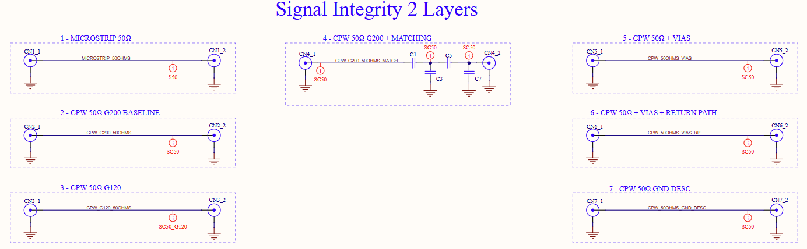

#### Stackup
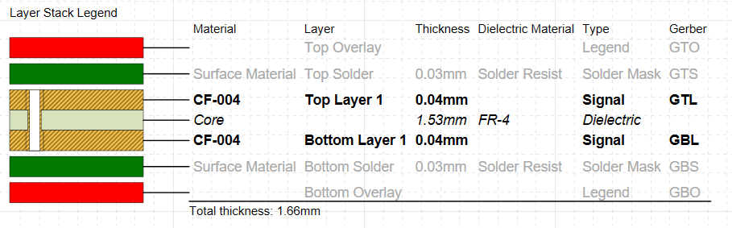

#### Vistas de layout PCB
<table>
  <tr>
    <td>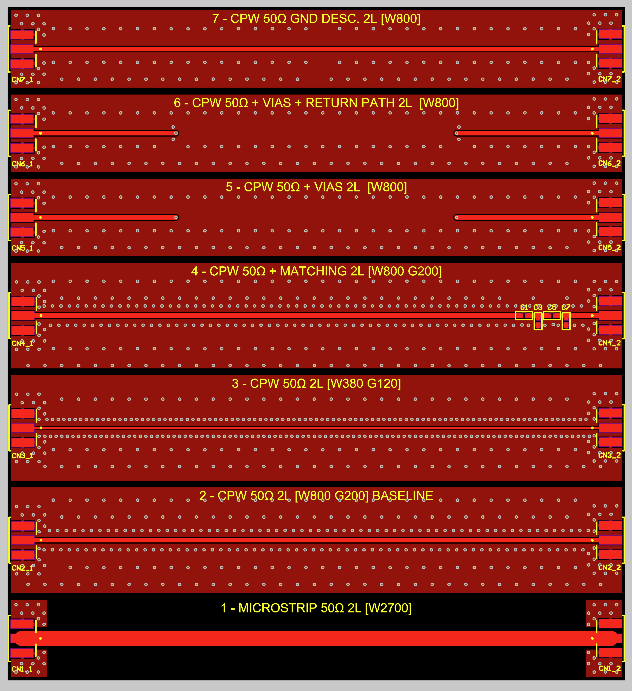</td>
    <td>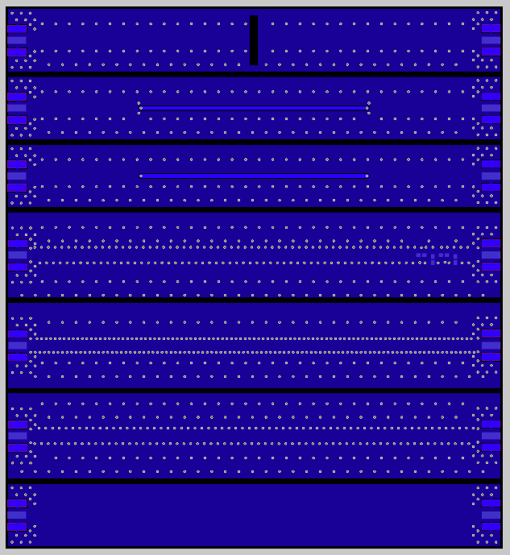</td>
  </tr>
</table>

#### Vista 3D
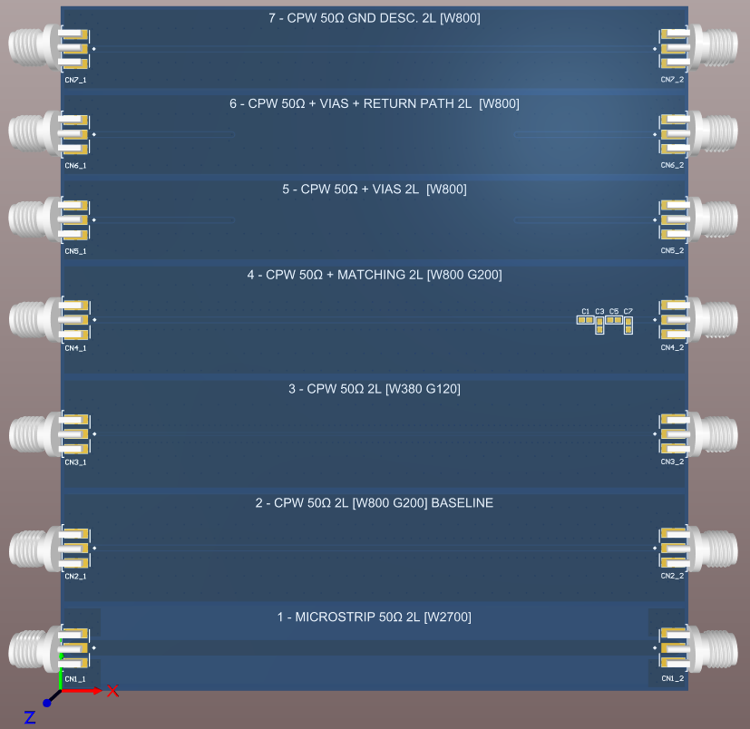

### Placa 4 camadas (`Signal_Integrity_4L_Simplified`)
Características principais:
- Ambiente de impedância controlada com stackup de 4 camadas (`JLC04161H-3313`), melhorando continuidade do caminho de retorno e confinamento de campo.
- Inclui variantes de cupons de 50 Ohm para isolar efeitos de layout:
  - referências baseline de microstrip e CPWG;
  - caso com transição em via e caso com via + melhoria de return path;
  - descontinuidade intencional no plano de GND (slot) para medir degradação;
  - variante com matching para comparação com o comportamento baseline.
- Funciona como plataforma de referência de maior controle para medições de integridade de sinal RF/high speed.

Variações de cupons e objetivos:
- `4L_01 - Microstrip 50 Ohm baseline (W350)`: referência baseline de microstrip com impedância controlada em 4 camadas.
- `4L_02 - CPWG 50 Ohm baseline (W285/G200)`: referência baseline de CPWG em 4 camadas.
- `4L_03 - CPWG 50 Ohm (W210/G120)`: variante geométrica de CPWG para comparar confinamento de campo e sensibilidade de tolerância versus G200.
- `4L_04 - CPWG 50 Ohm + matching (W285/G200)`: avalia o impacto da estratégia de matching em relação ao CPWG baseline.
- `4L_05 - Microstrip 50 Ohm + vias`: quantifica o impacto da descontinuidade de transição por via.
- `4L_06 - Microstrip 50 Ohm + vias + return path`: verifica redução de reflexão/ripple com melhoria do caminho de retorno próximo das transições.
- `4L_07 - Microstrip 50 Ohm + descontinuidade de GND (slot no L2)`: mede sensibilidade à interrupção intencional do plano de referência interno.

#### Esquemático
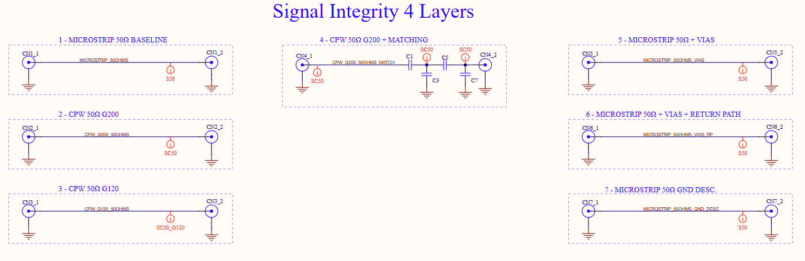

#### Stackup
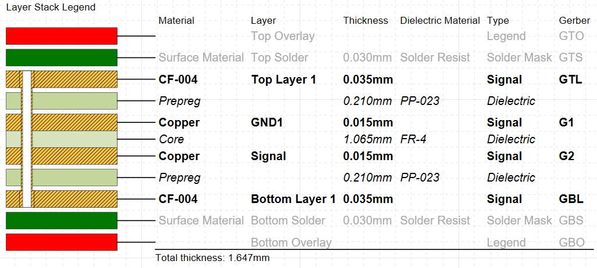

A Layer 2 e a layer bottom possuem polígonos de cobre conectados ao GND.

#### Vistas de layout PCB
<table>
  <tr>
    <td>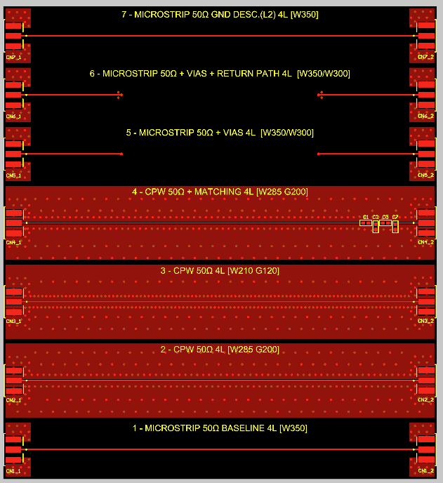</td>
    <td>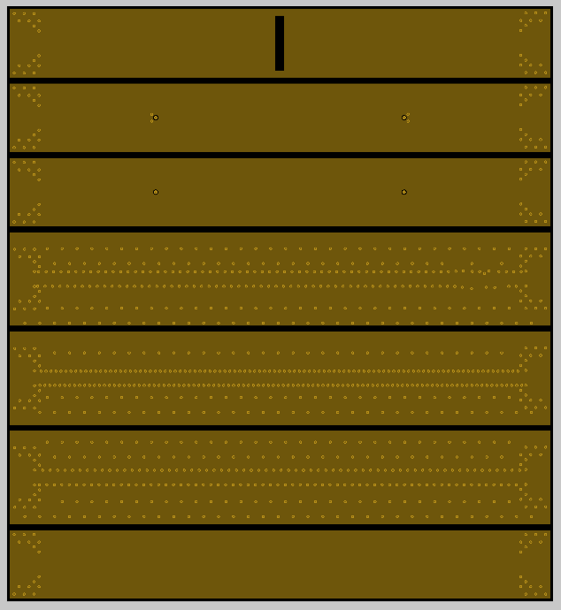</td>
  </tr>
  <tr>
    <td>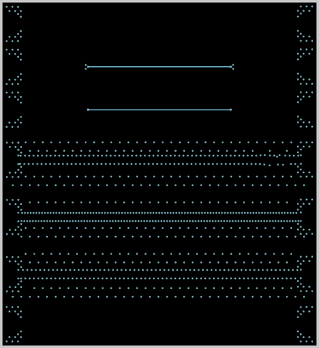</td>
    <td>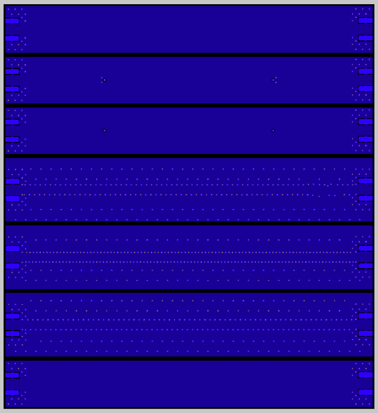</td>
  </tr>
</table>

#### Vista 3D
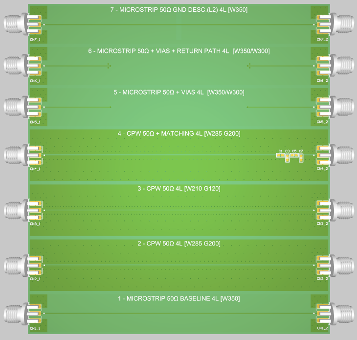

## NanoVNA-F V2 neste projeto
O NanoVNA-F V2 é usado como analisador vetorial de redes compacto para caracterizar reflexão e transmissão nos cupons de PCB.

Página oficial do produto:
- https://www.sysjoint.com/index.php?tpl=product_detail&pid=11&uid=17&id=65&sno=1&list=2&lang=en

Guias práticos NanoVNA V2:
- [Apostila NanoVNA V2 (Português)](./Nanovna_v2_pcb.md)

Imagem do equipamento:
 
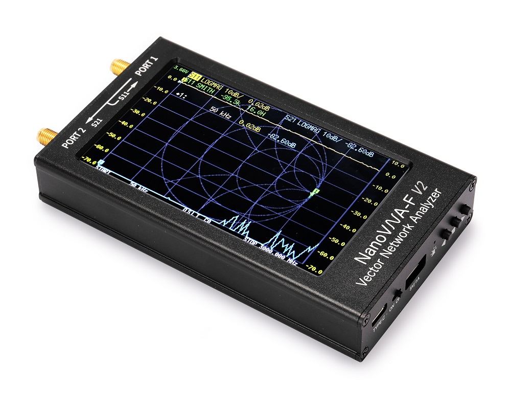

Destaques do fabricante (NanoVNA-F V2):
- Faixa de frequência: 50 kHz a 3 GHz
- Faixa dinâmica:
  - `S11`: 50 dB (<1.5 GHz), 40 dB (<3 GHz)
  - `S21`: 70 dB (<1.5 GHz), 60 dB (<3 GHz)
- Potência de saída RF: cerca de -9 dBm
- Display: IPS 4.3" (800x480)
- Bateria: 5000 mAh (até cerca de 7 horas)
- Interface: USB Type-C
- SWR de porta: <1.1

Conceitos-chave de parâmetros S usados neste projeto:
- `S11` (coeficiente de reflexão na entrada): indica quanto do sinal incidente é refletido de volta na entrada por descasamento de impedância. Valores mais negativos em dB normalmente indicam melhor casamento.
- `S21` (coeficiente de transmissão direta): indica quanto sinal vai da porta 1 para a porta 2 através da estrutura em teste. Menor perda significa `S21` mais próximo de 0 dB.

- Princípio de funcionamento:
  - Executa medição varrida em `CW` (um tom senoidal por ponto de frequência).
  - Usa amostragem direcional e detecção coerente `I/Q` para separar ondas incidente, refletida e transmitida.
  - Calcula parâmetros de espalhamento por medidas de razão (`S11` e `S21`).
- Funções utilizadas neste ensaio:
  - Calibração `SOLT 2-port` na ponta dos cabos (plano de referência nos conectores SMA).
  - `S11 LogMag` para análise de retorno / descasamento.
  - `S21 LogMag` para análise de perda de inserção e ripple/notch.
  - Varredura de frequência na banda selecionada (tipicamente 1-3 GHz) com 401 ou 801 pontos.
  - Exportação `.s2p` no NanoVNA Saver para documentação e pós-processamento opcional em domínio do tempo.

## NanoVNA Saver
O NanoVNA Saver é o software de desktop usado neste projeto para aquisição, visualização e exportação das medições do NanoVNA.

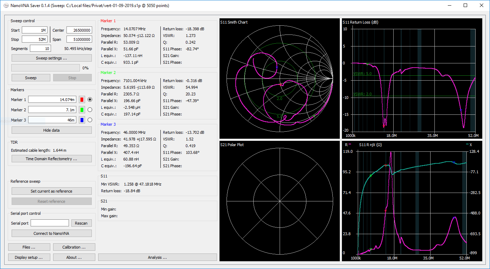

Página oficial:
- https://nanovna.com/?page_id=90

Principais funções usadas/disponíveis (conforme página oficial):
- Ler dados de medição do NanoVNA diretamente no PC.
- Segmentar spans de frequência para obter maior densidade de pontos que a varredura base (há relato de uso com >10k pontos).
- Fazer média de varreduras para melhorar estabilidade dos resultados, especialmente em frequências mais altas.
- Exibir múltiplos formatos de gráfico para `S11` e `S21` (por exemplo: Smith, LogMag, Fase, VSWR).
- Usar marcadores com valores derivados (impedância, VSWR, Q, L/C equivalente).
- Exportar e importar arquivos Touchstone 1-porta e 2-portas.
- Comparar traço ativo com traço de referência.
- Atualização em tempo real, incluindo varreduras multi-segmento.
- Suporte a calibração no software e exportação de imagens dos gráficos.

## Estrutura do repositório
- `Signal_Integrity_2L_Simplified/`: arquivos de projeto da placa de 2 camadas.
- `Signal_Integrity_4L_Simplified/`: arquivos de projeto da placa de 4 camadas.

## Links dos projetos
| Projeto | Arquivos no GitHub | Altium 365 |
|---|---|---|
| 2 Camadas | [Signal_Integrity_2L_Simplified](./Signal_Integrity_2L_Simplified/) | [Abrir no Altium 365](https://365.altium.com/files/987D5E5E-FB93-4543-97C9-5E7F92589402) |
| 4 Camadas | [Signal_Integrity_4L_Simplified](./Signal_Integrity_4L_Simplified/) | [Abrir no Altium 365](https://365.altium.com/files/C1313425-98CB-430A-858C-CD9CB5CA370C) |

## Testes (Roteiro e Relatório)
Para execução completa dos testes, ordem de medição, critérios de avaliação e tabela de resultados, consulte:

- [README-testes.md](./README-testes.md) (Português)

