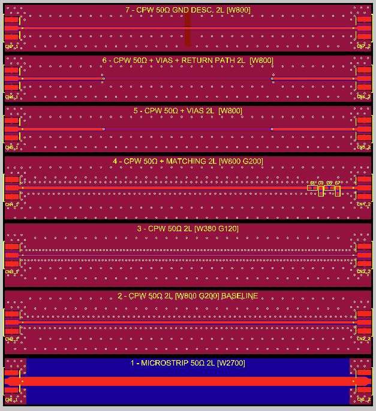

# Signal Integrity - 50 Ohm PCB Coupons (2L and 4L)

[🇺🇸 English](./README.md) | [🇧🇷 Português](./README-pt.md)

## Overview
This repository contains the design and validation material for 50 Ohm PCB test coupons focused on RF and high-speed signal integrity analysis.

The project compares line behavior across 2-layer and 4-layer boards, with emphasis on:
- impedance control;
- transmission quality;
- sensitivity to layout discontinuities.

## Why this project exists
In many practical RF/high-speed PCB developments, simulation alone does not capture all manufacturing and assembly variability. Manufacturing tolerances, dielectric variation, soldering, transitions, and ground return quality can significantly change real impedance and insertion/return loss behavior.

This project was created to measure these effects in a controlled way and extract layout guidelines from real data.

## Technical scope
- Boards:
  - 2L (standard FR-4)
  - 4L (JLC04161H-3313 stackup)
- Structures under test:
  - Microstrip 50 Ohm:
    - Basic concept: signal trace on an outer layer referenced to a ground plane below.
    - Advantages: simple routing, lower copper usage, easy implementation, common in mixed-signal and RF boards.
    - Disadvantages: stronger field exposure to air/environment, higher sensitivity to nearby discontinuities, and typically weaker confinement than CPWG.
    - Typical applications: general RF interconnects, moderate high-speed lines, and cost-sensitive designs.
  - CPWG (Coplanar Waveguide with Ground) 50 Ohm:
    - Basic concept: signal trace on an outer layer with coplanar ground on both sides plus a reference plane below.
    - In practice (especially on 2-layer boards), this structure often achieves 50 Ohm with narrower traces than plain microstrip, depending on stackup and manufacturing limits.
    - Advantages: better electromagnetic confinement, improved control of return current near the trace, and often better behavior at transitions/connectors.
    - Disadvantages: requires tighter layout control (trace-gap geometry), can be more sensitive to fabrication tolerance in narrow gaps, and may increase routing area.
    - Typical applications: RF paths requiring stronger field control, launches/connectors, and high-speed channels where discontinuity control is critical.
- Scenarios compared:
  - Baseline
  - Vias
  - Vias + return path
  - GND discontinuity (slot)
  - Matching variant (`matching` = impedance adjustment network/geometry used to reduce reflections and improve power transfer; this is especially important in RF chains and reflection-sensitive high-speed links to preserve signal integrity, minimize return loss, and stabilize frequency response)
- Instrumentation:
  - NanoVNA-F V2
  - NanoVNA Saver

### Stackup impact in this context
- Characteristic impedance is a stackup-dependent parameter, not only a trace-width parameter.
- For the same target (50 Ohm), required geometry changes with:
  - dielectric thickness between signal and reference plane;
  - effective dielectric constant (`Er`);
  - copper thickness and manufacturing tolerances;
  - solder mask and nearby ground geometry.
- Better stackup control generally improves repeatability of `S11/S21` across fabrication lots.

### Why microstrip is harder on 2-layer boards
- In 2-layer boards, achieving 50 Ohm microstrip often requires relatively wide traces because the distance to the reference plane is larger.
- Wider traces create practical limitations:
  - larger routing area consumption;
  - limited compatibility with modern package pin pitches, where very wide traces are often difficult to connect directly at pads/escapes without neck-down transitions and associated discontinuities;
  - stronger coupling to nearby discontinuities and connectors;
  - more sensitivity to local stackup and assembly variation.
- In many low-cost 2L processes, dielectric and copper tolerances are less tightly controlled than in controlled 4L stackups, increasing impedance spread.
- CPWG is frequently used in 2L as a mitigation strategy because coplanar grounds improve field confinement and return-current control compared to plain microstrip.

## Board design details

### 2-layer board (`Signal_Integrity_2L_Simplified`)
Main characteristics:
- Cost-oriented 2-layer implementation on standard FR-4, used to quantify how reduced stackup control impacts 50 Ohm routing.
- Mirrors the same measurement philosophy as the 4-layer board for direct comparability:
  - baseline structures;
  - vias and vias + return-path scenarios;
  - GND-discontinuity scenario;
  - matching variant.
- Useful to evaluate tradeoffs between manufacturability/cost and RF/high-speed performance stability.

Coupon variations and objectives:
- `2L_01 - Microstrip 50 Ohm (W2700)`: baseline reference for 2-layer microstrip behavior.
- `2L_02 - CPWG 50 Ohm baseline (W800/G200)`: baseline CPWG reference in 2L.
- `2L_03 - CPWG 50 Ohm (W380/G120)`: CPWG geometry variant to compare confinement and process sensitivity versus G200.
- `2L_04 - CPWG 50 Ohm + matching (W800/G200)`: evaluates matching strategy impact relative to CPWG baseline.
- `2L_05 - CPWG 50 Ohm + vias`: quantifies transition-induced discontinuity and added reflection/ripple.
- `2L_06 - CPWG 50 Ohm + vias + return path`: checks improvement from reinforcing return-current continuity around transitions.
- `2L_07 - CPWG 50 Ohm + GND discontinuity (slot)`: measures degradation caused by intentional return-path interruption.

Schematic:

Stackup:

PCB layout views:

3D view:

### 4-layer board (`Signal_Integrity_4L_Simplified`)
Main characteristics:
- Controlled-impedance environment using a 4-layer stackup (`JLC04161H-3313`), improving return-path continuity and field confinement.
- Includes 50 Ohm coupon variants to isolate layout effects:
  - baseline microstrip and CPWG references;
  - via-transition case and via + return-path improvement case;
  - intentional GND-plane discontinuity (slot) to measure degradation;
  - matching variant for comparison against baseline behavior.
- Intended as the higher-control reference platform for RF/high-speed SI measurements.

Coupon variations and objectives:
- `4L_01 - Microstrip 50 Ohm baseline (W350)`: baseline reference for controlled-impedance microstrip on 4L.
- `4L_02 - CPWG 50 Ohm baseline (W285/G200)`: baseline CPWG reference in 4L.
- `4L_03 - CPWG 50 Ohm (W210/G120)`: CPWG geometry variant to compare field confinement and tolerance sensitivity versus G200.
- `4L_04 - CPWG 50 Ohm + matching (W285/G200)`: evaluates matching strategy impact relative to CPWG baseline.
- `4L_05 - Microstrip 50 Ohm + vias`: quantifies via-transition discontinuity impact.
- `4L_06 - Microstrip 50 Ohm + vias + return path`: verifies reflection/ripple reduction with improved return-current path near transitions.
- `4L_07 - Microstrip 50 Ohm + GND discontinuity (slot on L2)`: measures sensitivity to intentional plane interruption in an inner reference layer.

Schematic:

Stackup:

PCB layout views:

3D view:

## NanoVNA-F V2 in this project
The NanoVNA-F V2 is used as a compact vector network analyzer to characterize reflections and transmission through PCB coupons.

- Principle of operation:
  - Performs a swept `CW` measurement (one sine tone per frequency point).
  - Uses directional sampling and coherent `I/Q` detection to separate incident, reflected, and transmitted waves.
  - Computes scattering parameters from ratio measurements (`S11` and `S21`).
- Functions used in this test campaign:
  - `SOLT 2-port` calibration at cable ends (reference plane at SMA connectors).
  - `S11 LogMag` for return loss / mismatch analysis.
  - `S21 LogMag` for insertion loss and ripple/notch analysis.
  - Frequency sweep in the selected band (typically 1-3 GHz) with 401 or 801 points.
  - `.s2p` export in NanoVNA Saver for documentation and optional time-domain post-processing.

## Repository structure
- `Signal_Integrity_2L_Simplified/`: 2-layer design files.
- `Signal_Integrity_4L_Simplified/`: 4-layer design files.

## Project links
| Project | GitHub files | Altium 365 |
|---|---|---|
| 2 Layers | [Signal_Integrity_2L_Simplified](./Signal_Integrity_2L_Simplified/) | [Open in Altium 365](https://365.altium.com/files/987D5E5E-FB93-4543-97C9-5E7F92589402) |
| 4 Layers | [Signal_Integrity_4L_Simplified](./Signal_Integrity_4L_Simplified/) | [Open in Altium 365](https://365.altium.com/files/C1313425-98CB-430A-858C-CD9CB5CA370C) |

## Tests (Script and Report)
For complete test execution, measurement order, acceptance criteria, and result table, see:

- [README-tests.md](./README-tests.md) (English)
- [README-testes.md](./README-testes.md) (Portuguese)

